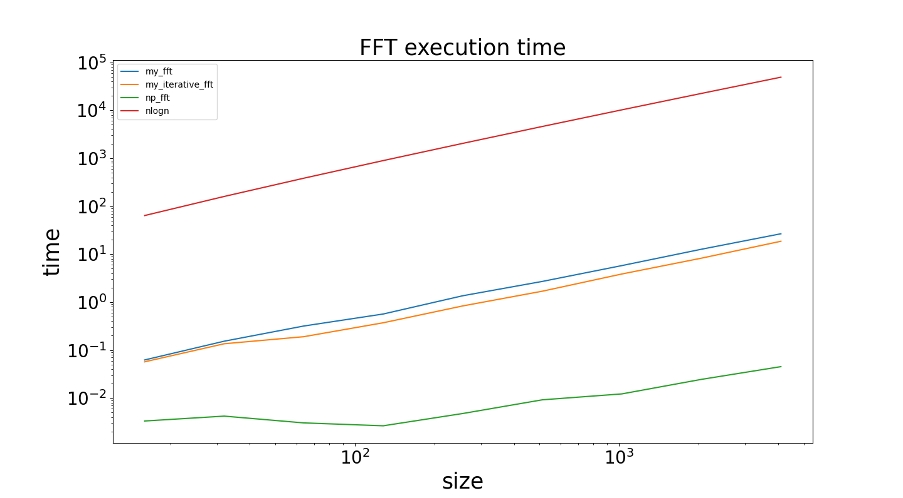
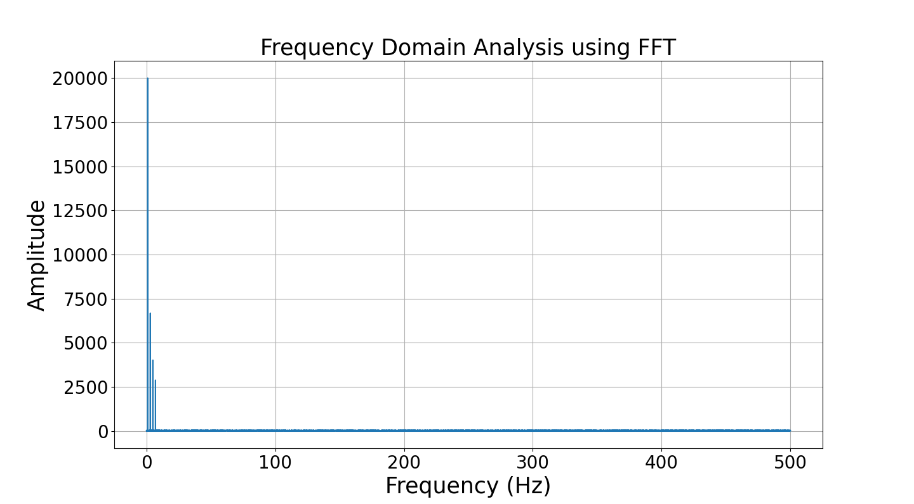
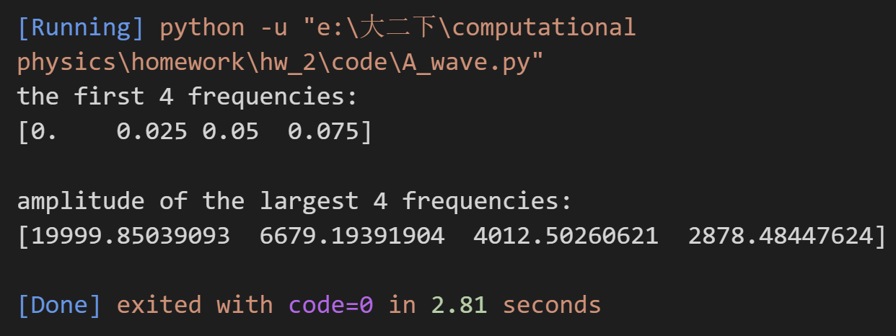
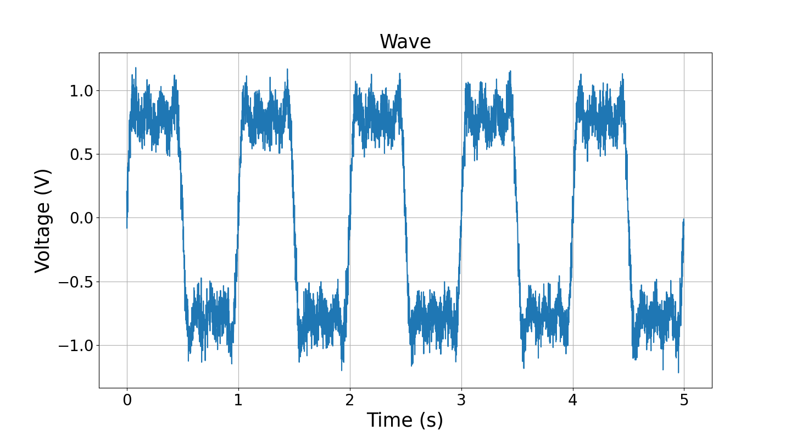
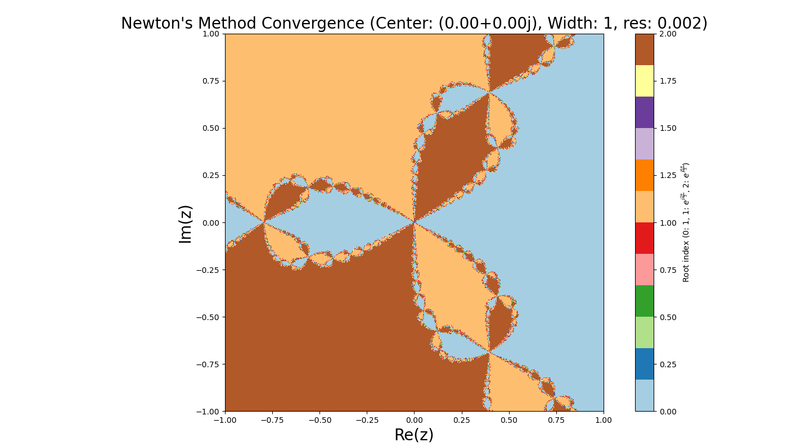
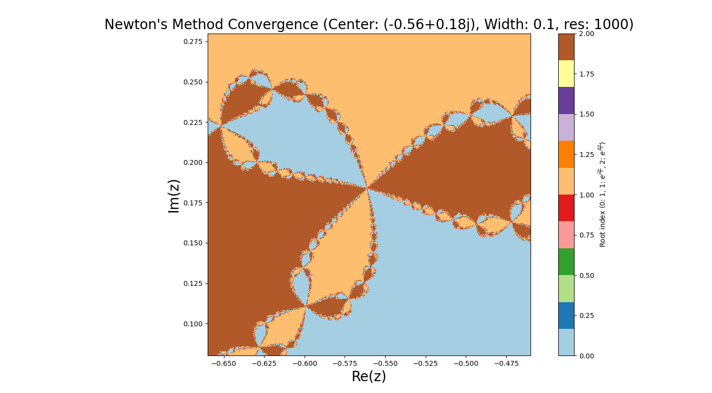
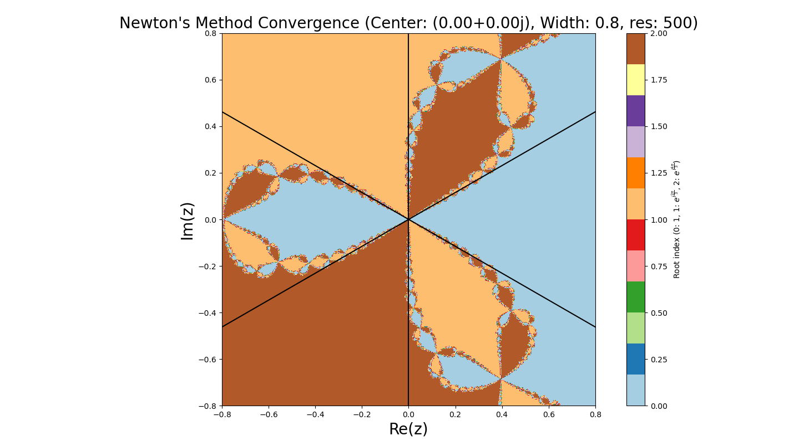

# 题目
## A．DFT和FFT

1．编写一个DFT程序，要求接受元素类型为 ````complex128（python）／ComplexF64（julia）````的一维数组。返回其离散傅里叶变换。给出测试样例（例如对随机数组做DFT）并对比FFTW等库函数的结果。（1分）

2．编写一个基本的Base2 FFT程序，检查输入数组长度是否为2的幂次；如果是则执行快速傅里叶变换FFT。不可以使用和fft相关的库函数。给出数组大小从 $2^4$ 到 $2^{12}$ 的测试样例。（1．5分）你的程序的计算复杂度理论上是什么？对比标准库，你的程序用时如何，符合复杂度的理论预期吗？（1分）

hint：使用递归的算法即可获得本题分数，但是有兴趣的同学可以探究如何编写正向递推的程序。如果你自己写的程序在部分算例上比库函数更快（这是有可能的），想想可能的原因，并分享给大家。在测试用时的时候，请使用较为准确的测试工具，至少精确到微秒。

3．分析信号：文件 ````waveform．dat```` 储存了示波器测量得到的电压信号，第一列数据为采样时间轴，第二列为对应时间点的电压值。请你使用FFT分析这段信号的频域特征，看看在频谱上发现了什么。本题使用库函数的FFT即可，无需自己写（2分）

## B．牛顿迭代法

使用牛顿迭代法求解复平面上的非线性方程 $f(z)=0$ ．其中

$$
f(z)=z^3-1, \quad z \in \mathbb{C}
$$


1．这个方程的根有哪些？（1分）

2．假设 $f(z)$ 为一个未知函数，现在使用标准的牛顿法迭代求解 $f(z)$ 的零点。初始的猜测解为 $z_0$ 。 请写出求解迭代过程中，$z_n$ 的递推公式。（1分）

3．记 $z=x+i y$ 。在 $x, y$ 平面上，以 $(x, y)=(0,0)$ 为中心， 1 为半宽的正方形区域内，取分辨率 0.002 ，探究平面上的不同点分别收敛到哪个根上，并可视化你的结果。（1分）

4．重复（3）的过程，但是分别放缩到

（a）．以 $(-0.8,0.0)$ 为中心， 0.25 为半宽，分辨率 0.0005 。

（b）．以 $(-0.56,0.18)$ 为中心， 0.1 为半宽，分辨率 0.0002 。

呈现你的可视化结果。（0．5分）你发现了什么有趣的现象？（1分）

# 项目结构
```
.
├── README.md
├── code
│   ├── A_dft.py 编写一个DFT程序并验证
│   ├── A_Base2_FFT.py 包含自己写的fft和iterative_fft程序，并记录用时
│   ├── A_wave.py 读取波形数据，并使用FFT分析
│   ├── B.py 牛顿迭代法求解复平面上的非线性方程
├── figure png文件

```


# 结果及讨论
## A.DFT和FFT
### 1.编写一个DFT程序并验证

如下所示，编写`my_dft`函数，实现对输入的数组进行DFT计算，并返回结果。
````python
def my_dft(x_array)->np.ndarray:
    N = len(x_array)
    n = np.arange(N)
    k = n.reshape((N,1))
    M = np.exp(-2j * np.pi * k * n / N)/N**0.5  
    return np.dot(M,x_array)
````
使用一个八维的随机复向量作为测试，并且使用`np.fft`作为标准包函数，测试数据、`my_dft`、`np.fft`给出的结果以及二者差值如下：


由上图结果可以看出，自己编写的函数和包函数给出的结果差值极小，可以认为自己编写的dft函数具有好的离散傅里叶变换的功能。

### 2.编写一个FFT程序并验证
#### 递归算法
运用递归思想，写出Base2 FFT程序如下：
````python
def fft(x):
    n = len(x)
    assert is_power_of_two(n), "输入数组的长度必须为2的幂次"
    if n==1:
        return x
    even = fft(x[0::2])
    odd = fft(x[1::2])
    T = [cmath.exp(-2j * cmath.pi * k / n) * odd[k] for k in range(n // 2)]
    # 利用离散傅里叶变换的性质:傅里叶变换的结果中前一半和后一半互为共轭
    return [even[k] + T[k] for k in range(n // 2)] + \
           [even[k] - T[k] for k in range(n // 2)]
````
首先验证程序的正确性：
使用一个八维的随机复向量作为测试，并与使用`np.fft`的结果进行比较，测试数据、`fft`、`np.fft`给出的结果以及二者差值如下：

由上图结果可以看出，自己编写的函数和包函数给出的结果差值极小，可以认为自己编写的fft函数具有好的快速离散傅里叶变换的功能。
在验证了程序的正确性后给出数组大小从$2^4$到$2^{12}$的测试样例，记录程序用时。

由上图可以看出，我所编写的fft函数用时多于标准库的用时。
接下来分析我的代码的时间复杂度：
递归调用的次数为$log_2(n)$，每次递归调用
```` python
T = [cmath.exp(-2j * cmath.pi * k / n) * odd[k] for k in range(n // 2)]
    # 利用离散傅里叶变换的性质:傅里叶变换的结果中前一半和后一半互为共轭
    return [even[k] + T[k] for k in range(n // 2)] + \
           [even[k] - T[k] for k in range(n // 2)] 
````
语句的时间复杂度为$O（\frac{n}{2}）$（此处考虑到离散傅里叶变换的形式，即前一半与后一半互为复共轭），递归调用的深度为$O(log_2(n))$，因此时间复杂度为$O(\frac{nlog_2(n)}{2}) = O(nlog_2(n))$。
而这也是理论上最小的时间复杂度。同时不难发现该算法的空间复杂度也是$O(nlog_2(n))$
我的程序用时多于标准库函数的原因分析如下：
1. 我的程序中使用了for循环，时间上有较大的开销，即使我使用了list-generator语法，但是for循环的开销还是较大的。
2. python内置list比较慢
3. 我的程序是递归算法，多次递归进入函数也产生了一定的时间开销。

因此，我运用“蝴蝶运算”，改变了数组顺序，时间复杂度仍为$O(nlog_2(n))$，但是空间复杂度降为$O(1)$。相关代码记为````my_iterative_fft````，测试样例及结果如下：



由图中可以看出，
1. 无论是我编写的````my_fft````还是````my_iterative_fft````，以及标准库函数````np_fft````,时间复杂度均为$O(nlog_2(n))$，与之前的理论分析吻合。
2. ````my_fft````和````my_iterative_fft````在算例较小的时候用时接近，在算例增加的时候，````my_fft````用时略长于````my_iterative_fft````，原因为````my_iterative_fft````不必多次递归带入函数，减小了这部分的时间开销，在算例较大的时候有一定的时间优势。


### 3.分析信号
采集````waveform.dat````文件，将其中的数据调用库函数进行快速傅里叶变换，得到频谱如下：

由上图可以看出，该波形的频率有如下的特点：
1. 主频能量集中，大部分信号能量几种在低频区域（靠近0Hz）的位置，共有4个尖峰，说明由4个主频组成。
2. 高频区域信号较弱,大约从几十Hz到500 Hz频段的信号幅度极低接近于零，意味着信号中较高频率的成分非常小，几乎不存在，可能是存在一个频率跨度很大的噪声。

进一步地，探究四个峰值的强度大小和频率关系：

如上图所示，可以看出四个峰值的频率之比恰好为：$1:2:3:4$,强度之比恰好是$1:\frac{1}{3}:\frac{1}{5}:\frac{1}{7}$，联系方波的分解，我们可以得出wave大致是方波。
为了验证，画出前5000个点的波形图：

由图中可以看出，wave数据确实大致是一个方波。

## B. 牛顿迭代法
### 1.给出方程的根
对于方程
$$f(z) = z^3 - 1 ,z \in \mathbb{C} $$
方程的根有：
$$z_1 = 1, z_2 = e^{i\frac{2\pi}{3}}, z_3 = e^{i\frac{4\pi}{3}}$$

### 2.给出$z_n$的递推公式
使用牛顿法：
$$z_{n+1} = z_n - \frac{f(z_n)}{f'(z_n)}$$
此处：
$$f(z_n) = z_n^3 - 1$$
$$f'(z_n) = 3z_n^2$$
所以得到递推公式如下：
$$z_{n+1} = z_n - \frac{z_n^3 - 1}{3z_n^2} = \frac{2z_n^3 +1}{3z_n^2}$$
### 3. 在1为半宽的正方形上收敛到的根的情况
．记 $z=x+i y$ 。在 $x, y$ 平面上，以 $(x, y)=(0,0)$ 为中心， 1 为半宽的正方形区域内，取分辨率 0.002 ，探究平面上的不同点分别收敛到哪个根上，得到结果如下：

### 4.放缩
#### （a）以 $(-0.8,0.0)$ 为中心， 0.25 为半宽，分辨率 0.0005。


#### （b）以 $(-0.56,0.18)$ 为中心， 0.1 为半宽，分辨率 0.0002。


#### 发现：
由以上三张可视化结果可以发现：
1. 三个单位根周边的初始点会收敛到该单位根上，但是辐角为$\frac{\pi}{3}$的根会收敛到$e^{\frac{4\pi}{3}}$上，辐角为$\pi$的根会收敛到$1$上,辐角为$\frac{5\pi}{3}$的根会收敛到$e^{\frac{2\pi}{3}}$上，即辐角为$\frac{\pi}{3}$,$\pi$,$\frac{5\pi}{3}$的初始点倾向于收敛到“对角”的解上。
2. 随着图像的放大，图像呈现出“分形”的特点，也就是存在“自相似”性。
3. 放大后分形的角度是会转动的，角度是否转动取决于中心所在分形的指向，比如 $(-0.8,0.0)$ 为中心图所在分形指向是水平的，所以放大后分形角度没有转到；而$(-0.56,0.18)$ 为中心的图在辐角为$\frac{\pi}{3}$的根处，所以放大后分形角度会转动。
4. 在加入辅助线后可以看出，颜色由$y = tan(30\degree)x$,$x = 0$,$y = -tan(30\degree)x$，$y = tan(30\degree)x$,$x = 0$,$y = -tan(30\degree)x$ 六条线分割

5. 由下图可以看出，在分形结点处，辐角为$\frac{\pi}{6}$,$\frac{\pi}{2}$,$\frac{5\pi}{6}$,$\frac{7\pi}{6}$,${\frac{2\pi}{3}}$,$\frac{11\pi}{6}$的初始点不收敛


# 附录
代码可见：https://github.com/jtzhao29/computational_physics_hw2.git
## A_dft.py
````python
import numpy as np
import pandas as pd


def my_dft_norm(x_array)->np.ndarray:
    """
    自己编写一个DFT程序，要求接受元素类型为
    complex128(python)/ComplexF64(julia) 
    的⼀维数组，返回其离散傅⾥叶变换
    """
    N = len(x_array)
    n = np.arange(N)
    k = n.reshape((N,1))
    M = np.exp(-2j * np.pi * k * n / N)/N**0.5  #np.exp(np.array) 会对数组中的每个元素应用指数函数 exp
    return np.dot(M,x_array)

def my_dft(x_array)->np.ndarray:
    """
    自己编写一个DFT程序，要求接受元素类型为
    complex128(python)/ComplexF64(julia) 
    的⼀维数组，返回其离散傅⾥叶变换
    """
    N = len(x_array)
    n = np.arange(N)
    k = n.reshape((N,1))
    M = np.exp(-2j * np.pi * k * n / N) #np.exp(np.array) 会对数组中的每个元素应用指数函数 exp
    return np.dot(M,x_array)


if __name__ == '__main__':
    # 测试样例:随机数组
    np.random.seed(0)  # 设置seed可以保证输出结果相同
    x = np.random.rand(8) + 1j * np.random.rand(8)
    x = x.astype(np.complex128)
    # Dataframe.astype(dtype, copy:defalt True, errors='raise')Cast a pandas object to a specified dtype dtype.

    my_dft_result = my_dft(x)
    FFTW_result = np.fft.fft(x,norm='ortho')

    print("\nTesting data",x)
    print("\nMy DFT result",my_dft_result)
    print("\nNumpy FFT result",FFTW_result)

    print("\nMy DFT result - Numpy FFT result",my_dft_result-FFTW_result)
````

## A_Base2_FFT.py 

```` python
import numpy as np
from A_dft import my_dft
import cmath
from timeit import timeit
import matplotlib.pyplot as plt
def is_power_of_two(n)->bool:
    """
    判断一个数是否是2的幂
    """
    return n > 0 and (n & (n - 1)) == 0
    #如果是2的幂次，则则其二进制表示中只有一个比特位为 1

def fft(x):
    """
    快速傅里叶变换,自己写的，递归算法
    """
    n = len(x)
    if n==1:
        return x
    
    even = fft(x[0::2])
    odd = fft(x[1::2])
    T = [cmath.exp(-2j * cmath.pi * k / n) * odd[k] for k in range(n // 2)]
    # 利用离散傅里叶变换的性质:傅里叶变换的结果中前一半和后一半互为共轭
    return [even[k] + T[k] for k in range(n // 2)] + \
           [even[k] - T[k] for k in range(n // 2)]

def iterative_fft(x):
    """
    快速傅里叶变换,自己写的，非递归算法，蝴蝶运算的那个
    """
    n = len(x)
    log_n = int(np.log2(n))

    W = [cmath.exp(-2j * cmath.pi / (1 << i)) for i in range(log_n + 1)]

    result = np.array(x)
    indices = np.arange(n)
    indices = np.bitwise_or.reduce([((indices >> i) & 1) << (log_n-1-i) for i in range(log_n)], axis=0)
    result = result[indices]

    half_size = 1
    for level in range(log_n):
        step = half_size * 2
        for start in range(0, n, step):
            factor = 1
            for i in range(half_size):
                even = result[start + i]
                odd = factor * result[start + half_size + i]
                result[start + i] = even + odd
                result[start + half_size + i] = even - odd
                factor *= W[level + 1]
        half_size = step

    return result


if __name__ == '__main__':
    # # 测试样例:随机数组
    # np.random.seed(0)  # 设置seed可以保证输出结果相同
    # x = np.random.rand(8) + 1j * np.random.rand(8)
    # x = x.astype(np.complex128)
   
    # my_fft_y = fft(x)
    # my_dft_y = my_dft(x)
    # FFT_y = np.fft.fft(x)
    # print("\nTesting data",x)
    # print("\nMy FFT result",my_fft_y)
    # # print("\nMy DFT result",my_dft_y)
    # print("\nFFTW result",FFT_y)

    # 给出数组⼤⼩从2**4到2**12的测试样例
    size = [2**i for i in range(4,13)]
    my_fft = []
    my_iterative_fft = []
    np_fft = []
    for i in size:
        if  is_power_of_two(i):
            x = np.random.rand(i) + 1j * np.random.rand(i)
            x = x.astype(np.complex128)
            exec_time_my_fft = timeit(lambda: fft(x),number=1000)
            exec_time_fft = timeit(lambda: np.fft.fft(x),number=1000)
            exec_time_iterative_fft = timeit(lambda: iterative_fft(x),number=1000)
            my_fft.append(exec_time_my_fft/1000)
            my_iterative_fft.append(exec_time_iterative_fft/1000)
            np_fft.append(exec_time_fft/1000)
            
            print(f"my fft for size{i},exection time:{exec_time_my_fft}")
            # print(f"my iterative_fft for size{i},exection time:{exec_time_iterative_fft}")
            print(f"np.fft for size{i},exection time:{exec_time_fft}")

    nlogn = [i*np.log2(i) for i in size]

    plt.plot(size,my_fft,label="my_fft")
    plt.plot(size,my_iterative_fft,label="my_iterative_fft")
    plt.plot(size,np_fft,label="np_fft")
    plt.plot(size,nlogn,label="nlogn")
    plt.xscale('log')
    plt.yscale('log')
    plt.legend()
    plt.xlabel('size',fontsize=25)
    plt.ylabel('time',fontsize=25)
    plt.title('FFT execution time',fontsize=25)
    plt.xticks(fontsize=20)
    plt.yticks(fontsize=20)
    plt.show()
````
## A_wave.py 
````python
import numpy as np
import matplotlib.pyplot as plt

data = np.loadtxt("./data/waveform.dat")
time = data[:,0]
voltage = data[:,1]

sampling_rate = 1 / (time[1] - time[0])
n = len(voltage)
freq = np.fft.fftfreq(n, d=1/sampling_rate)
fft_values = np.fft.fft(voltage)

plt.figure(figsize=(12, 6))


plt.plot(freq[:n//2], np.abs(fft_values)[:n//2])
plt.title('Frequency Domain Analysis using FFT',fontsize=25)
plt.xlabel('Frequency (Hz)',fontsize=25)
plt.ylabel('Amplitude',fontsize = 25)
plt.xticks(fontsize=20)
plt.yticks(fontsize=20)
plt.grid()
plt.show()

print("the first 4 frequencies:")
print(freq[:4])

def find_the_largest4(Amplitude:np.ndarray)->np.ndarray:
    """\n"""
    Amplitude = np.abs(Amplitude)
    Amplitude = Amplitude[:n//2]
    Amplitude = Amplitude[np.argsort(Amplitude)[::-1]]
    return Amplitude[:4]

print("\namplitude of the largest 4 frequencies:")
print(find_the_largest4(fft_values))

plt.plot(time[:5000], voltage[:5000])
plt.title('Wave',fontsize=25)
plt.xlabel('Time (s)',fontsize=25)
plt.ylabel('Voltage (V)',fontsize = 25)
plt.xticks(fontsize=20)
plt.yticks(fontsize=20)
plt.grid()
plt.show()
````
## B.py 
````python
import numpy as np
import matplotlib.pyplot as plt

def f(z):
    """
    方程 f(z) = z^3 - 1
    """
    return z**3 - 1

def f_prime(z):
    """
    方程 f'(z) = 3z^2
    """
    return 3 * z**2

def newton_method(z0, max_iter=100, tol=1e-6):
    """
    牛顿迭代法
    z0: 初始猜测值
    max_iter: 最大迭代次数
    tol: 收敛容忍度
    """
    z = z0
    for _ in range(max_iter):
        dz = f(z) / f_prime(z)
        z = z - dz
        if abs(dz) < tol:
            break
    return z

def get_convergence_region(center, width, resolution, bias=1e-5):
    """
    获取在复平面上牛顿法的收敛区域
    center: 中心点 (复数)
    width: 半宽度，表示正方形区域的范围
    resolution: 网格的分辨率
    bias: 收敛的容忍度
    """
    x_min, x_max = center.real - width, center.real + width
    y_min, y_max = center.imag - width, center.imag + width
    x_vals = np.linspace(x_min, x_max, resolution)
    y_vals = np.linspace(y_min, y_max, resolution)
    
    # 创建网格
    X, Y = np.meshgrid(x_vals, y_vals)
    Z = X + 1j * Y
    
    # 根的集合
    roots = [1, np.exp(2j * np.pi / 3), np.exp(4j * np.pi / 3)]  # 3个根
    
    # 收敛区域
    region = np.zeros(Z.shape, dtype=int)
    
    # 对每个点应用牛顿法
    for i in range(Z.shape[0]):
        for j in range(Z.shape[1]):
            z = Z[i, j]
            # 对每个初始点进行牛顿迭代
            z_final = newton_method(z, max_iter=50, tol=bias)
            # 找到收敛的根
            distances = [abs(z_final - root) for root in roots]
            region[i, j] = np.argmin(distances)  # 收敛到哪个根
    
    return region, X, Y

def plot_convergence(center, width, resolution, bias=1e-5):
    """
    可视化牛顿法收敛区域
    """
    region, X, Y = get_convergence_region(center, width, resolution, bias)
    x1 = np.linspace(center,center+width,1000)
    y1 = x1*(3**0.5)/3
    x0 = np.linspace(center,center,1000)
    x2 = np.linspace(center-width,center,1000)
    y0 = np.linspace(center,center+width,1000)
    y2 = x2*(3**0.5)/3
    y22 = -x2*(3**0.5)/3

    # 绘制收敛图
    plt.figure(figsize=(8, 6))
    plt.imshow(region, extent=(X.min(), X.max(), Y.min(), Y.max()), origin='lower', cmap='Paired')
    plt.plot(x1,y1,color = 'black')
    plt.plot(x0,y0,color = 'black')
    plt.plot(x2,y22,color = 'black')
    plt.plot(x2,y2,color = 'black')
    plt.plot(x0,-y0,color = 'black')
    plt.plot(x1,-y1,color = 'black')
    plt.colorbar(label='Root index (0: 1, 1: $e^{i\\frac{2\\pi}{3}}$, 2: $e^{i\\frac{4\\pi}{3}}$)')
    center_str = f"({center.real:.2f}{center.imag:+.2f}j)"
    
    plt.title(f"Newton's Method Convergence (Center: {center_str}, Width: {width}, res: {resolution})", fontsize=20)
      
    plt.xlabel('Re(z)',fontsize=20)
    plt.ylabel('Im(z)',fontsize=20)
    plt.show()


# 测试可视化
plot_convergence(center=0.0+0.0j, width=0.8, resolution=500, bias=1e-5)

# plot_convergence(center=-0.8+0j,width=0.25,resolution=1000)
# plot_convergence(center=-0.56+0.18j,width=0.1,resolution=1000)
````
