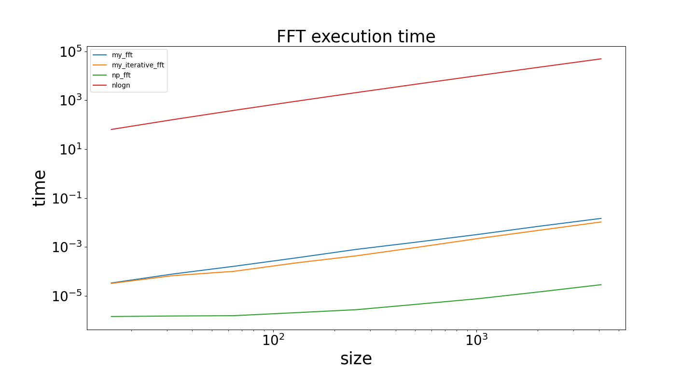
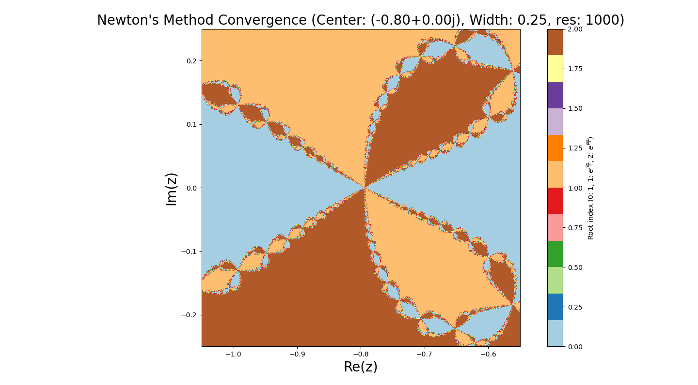

# 题目
## A．DFT和FFT

1．编写一个DFT程序，要求接受元素类型为 ````complex128（python）／ComplexF64（julia）````的一维数组。返回其离散傅里叶变换。给出测试样例（例如对随机数组做DFT）并对比FFTW等库函数的结果。（1分）
2．编写一个基本的Base2 FFT程序，检查输入数组长度是否为2的幂次；如果是则执行快速傅里叶变换FFT。不可以使用和fft相关的库函数。给出数组大小从 $2^4$ 到 $2^{12}$ 的测试样例。（1．5分）你的程序的计算复杂度理论上是什么？对比标准库，你的程序用时如何，符合复杂度的理论预期吗？（1分）
hint：使用递归的算法即可获得本题分数，但是有兴趣的同学可以探究如何编写正向递推的程序。如果你自己写的程序在部分算例上比库函数更快（这是有可能的），想想可能的原因，并分享给大家。在测试用时的时候，请使用较为准确的测试工具，至少精确到微秒。
3．分析信号：文件 ````waveform．dat```` 储存了示波器测量得到的电压信号，第一列数据为采样时间轴，第二列为对应时间点的电压值。请你使用FFT分析这段信号的频域特征，看看在频谱上发现了什么。本题使用库函数的FFT即可，无需自己写（2分）

## B．牛顿迭代法

使用牛顿迭代法求解复平面上的非线性方程 $f(z)=0$ ．其中

$$
f(z)=z^3-1, \quad z \in \mathbb{C}
$$


1．这个方程的根有哪些？（1分）
2．假设 $f(z)$ 为一个未知函数，现在使用标准的牛顿法迭代求解 $f(z)$ 的零点。初始的猜测解为 $z_0$ 。 请写出求解迭代过程中，$z_n$ 的递推公式。（1分）
3．记 $z=x+i y$ 。在 $x, y$ 平面上，以 $(x, y)=(0,0)$ 为中心， 1 为半宽的正方形区域内，取分辨率 0.002 ，探究平面上的不同点分别收敛到哪个根上，并可视化你的结果。（1分）
4．重复（3）的过程，但是分别放缩到
（a）．以 $(-0.8,0.0)$ 为中心， 0.25 为半宽，分辨率 0.0005 。
（b）．以 $(-0.56,0.18)$ 为中心， 0.1 为半宽，分辨率 0.0002 。
呈现你的可视化结果。（0．5分）你发现了什么有趣的现象？（1分）

# 结果及讨论
## A.DFT和FFT
### 1.编写一个DFT程序并验证

如下所示，编写`my_dft`函数，实现对输入的数组进行DFT计算，并返回结果。
````python
def my_dft(x_array)->np.ndarray:
    N = len(x_array)
    n = np.arange(N)
    k = n.reshape((N,1))
    M = np.exp(-2j * np.pi * k * n / N)/N**0.5  
    return np.dot(M,x_array)
````
使用一个八维的随机复向量作为测试，并且使用`np.fft`作为标准包函数，测试数据、`my_dft`、`np.fft`给出的结果以及二者差值如下：


由上图结果可以看出，自己编写的函数和包函数给出的结果差值极小，可以认为自己编写的dft函数具有好的离散傅里叶变换的功能。

### 2.编写一个FFT程序并验证
#### 递归算法
运用递归思想，写出Base2 FFT程序如下：
````python
def fft(x):
    n = len(x)
    assert is_power_of_two(n), "输入数组的长度必须为2的幂次"
    if n==1:
        return x
    even = fft(x[0::2])
    odd = fft(x[1::2])
    T = [cmath.exp(-2j * cmath.pi * k / n) * odd[k] for k in range(n // 2)]
    # 利用离散傅里叶变换的性质:傅里叶变换的结果中前一半和后一半互为共轭
    return [even[k] + T[k] for k in range(n // 2)] + \
           [even[k] - T[k] for k in range(n // 2)]
````
首先验证程序的正确性：
使用一个八维的随机复向量作为测试，并与使用`np.fft`的结果进行比较，测试数据、`fft`、`np.fft`给出的结果以及二者差值如下：

由上图结果可以看出，自己编写的函数和包函数给出的结果差值极小，可以认为自己编写的fft函数具有好的快速离散傅里叶变换的功能。
在验证了程序的正确性后给出数组大小从$2^4$到$2^{12}$的测试样例，记录程序用时。

由上图可以看出，我所编写的fft函数用时多于标准库的用时。
接下来分析我的代码的时间复杂度：
递归调用的次数为$log_2(n)$，每次递归调用
```` python
T = [cmath.exp(-2j * cmath.pi * k / n) * odd[k] for k in range(n // 2)]
    # 利用离散傅里叶变换的性质:傅里叶变换的结果中前一半和后一半互为共轭
    return [even[k] + T[k] for k in range(n // 2)] + \
           [even[k] - T[k] for k in range(n // 2)] 
````
语句的时间复杂度为$O（\frac{n}{2}）$（此处考虑到离散傅里叶变换的形式，即前一半与后一半互为复共轭），递归调用的深度为$O(log_2(n))$，因此时间复杂度为$O(\frac{nlog_2(n)}{2}) = O(nlog_2(n))$。
而这也是理论上最小的时间复杂度。同时不难发现该算法的空间复杂度也是$O(nlog_2(n))$
我的程序用时多于标准库函数的原因分析如下：
1. 我的程序中使用了for循环，时间上有较大的开销，即使我使用了list-generator语法，但是for循环的开销还是较大的。
2. python内置list比较慢
3. 我的程序是递归算法，多次递归进入函数也产生了一定的时间开销。

因此，我运用“蝴蝶运算”，改变了数组顺序，时间复杂度仍为$O(nlog_2(n))$，但是空间复杂度降为$O(1)$。相关代码记为````my_iterative_fft````，测试样例及结果如下：



由图中可以看出，
1. 无论是我编写的````my_fft````还是````my_iterative_fft````，以及标准库函数````np_fft````,时间复杂度均为$O(nlog_2(n))$，与之前的理论分析吻合。
2. ````my_fft````和````my_iterative_fft````在算例较小的时候用时接近，在算例增加的时候，````my_fft````用时略长于````my_iterative_fft````，原因为````my_iterative_fft````不必多次递归带入函数，减小了这部分的时间开销，在算例较大的时候有一定的时间优势。


### 3.分析信号
采集````waveform.dat````文件，将其中的数据调用库函数进行快速傅里叶变换，得到频谱如下：

由上图可以看出，该波形的频率有如下的特点：
1. 主频能量集中，大部分信号能量几种在低频区域（靠近0Hz）的位置，共有4个尖峰，说明由4个主频组成。
2. 高频区域信号较弱,大约从几十Hz到500 Hz频段的信号幅度极低接近于零，意味着信号中较高频率的成分非常小，几乎不存在，可能是存在一个频率跨度很大的噪声。


## B. 牛顿迭代法
### 1.给出方程的根
对于方程
$$f(z) = z^3 - 1 ,z \in \mathbb{C} $$
方程的根有：
$$z_1 = 1, z_2 = e^{i\frac{2\pi}{3}}, z_3 = e^{i\frac{4\pi}{3}}$$

### 2.给出$z_n$的递推公式
使用牛顿法：
$$z_{n+1} = z_n - \frac{f(z_n)}{f'(z_n)}$$
此处：
$$f(z_n) = z_n^3 - 1$$
$$f'(z_n) = 3z_n^2$$
所以得到递推公式如下：
$$z_{n+1} = z_n - \frac{z_n^3 - 1}{3z_n^2} = \frac{2z_n^3 +1}{3z_n^2}$$
### 3. 在1为半宽的正方形上收敛到的根的情况
．记 $z=x+i y$ 。在 $x, y$ 平面上，以 $(x, y)=(0,0)$ 为中心， 1 为半宽的正方形区域内，取分辨率 0.002 ，探究平面上的不同点分别收敛到哪个根上，得到结果如下：

### 4.放缩
#### （a）以 $(-0.8,0.0)$ 为中心， 0.25 为半宽，分辨率 0.0005。


#### （b）以 $(-0.56,0.18)$ 为中心， 0.1 为半宽，分辨率 0.0002。
