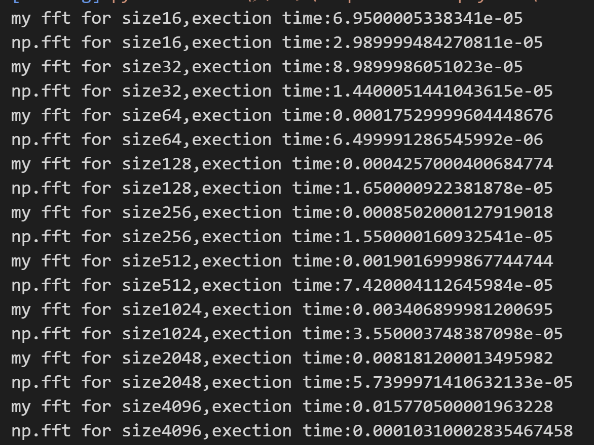

# 结果及讨论
## A.DFT和FFT
### 1.编写一个DFT程序并验证

如下所示，编写`my_dft`函数，实现对输入的数组进行DFT计算，并返回结果。
````python
def my_dft(x_array)->np.ndarray:
    N = len(x_array)
    n = np.arange(N)
    k = n.reshape((N,1))
    M = np.exp(-2j * np.pi * k * n / N)/N**0.5  
    return np.dot(M,x_array)
````
使用一个八维的随机复向量作为测试，并且使用`np.fft`作为标准包函数，测试数据、`my_dft`、`np.fft`给出的结果以及二者差值如下：


由上图结果可以看出，自己编写的函数和包函数给出的结果差值极小，可以认为自己编写的dft函数具有好的离散傅里叶变换的功能。

### 2.编写一个FFT程序并验证
#### 递归算法
运用递归思想，写出Base2 FFT程序如下：
````python
def fft(x):
    n = len(x)
    assert is_power_of_two(n), "输入数组的长度必须为2的幂次"
    if n==1:
        return x
    even = fft(x[0::2])
    odd = fft(x[1::2])
    T = [cmath.exp(-2j * cmath.pi * k / n) * odd[k] for k in range(n // 2)]
    # 利用离散傅里叶变换的性质:傅里叶变换的结果中前一半和后一半互为共轭
    return [even[k] + T[k] for k in range(n // 2)] + \
           [even[k] - T[k] for k in range(n // 2)]
````
首先验证程序的正确性：
使用一个八维的随机复向量作为测试，并与使用`np.fft`的结果进行比较，测试数据、`fft`、`np.fft`给出的结果以及二者差值如下：

由上图结果可以看出，自己编写的函数和包函数给出的结果差值极小，可以认为自己编写的fft函数具有好的快速离散傅里叶变换的功能。
在验证了程序的正确性后给出数组大小从$2^4$到$2^{12}$的测试样例，记录程序用时。

由上图可以看出，我所编写的fft函数用时多于标准库的用时。
接下来分析我的代码的时间复杂度：
1. 递归调用的次数为$log_2(n)$，每次递归调用的
```` python
T = [cmath.exp(-2j * cmath.pi * k / n) * odd[k] for k in range(n // 2)]
    # 利用离散傅里叶变换的性质:傅里叶变换的结果中前一半和后一半互为共轭
    return [even[k] + T[k] for k in range(n // 2)] + \
           [even[k] - T[k] for k in range(n // 2)] 
````
语句的时间复杂度为$O（\frac{n}{2}）$（此处考虑到离散傅里叶变换的形式，即前一半与后一半互为复共轭），因此时间复杂度为$O(\frac{nlog_2(n)}{2}) = O(nlog_2(n))$。
而这也是理论上最小的时间复杂度。
我的程序用时多于标准库函数的原因分析如下：
1. 我的程序使用了递归算法，
